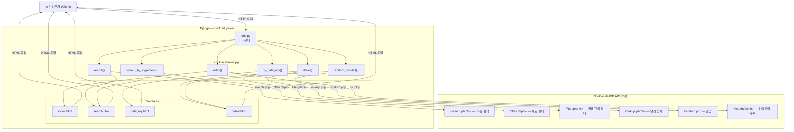

# CocktailDB 칵테일 검색기

> TheCocktailDB 무료 API를 활용한 Django 기반 칵테일 검색 웹 애플리케이션

---

## 개요


| 구분 | 사용 기술 |
|------|-----------|
| Backend | Python 3, Django 6 |
| Frontend | Bootstrap 5.3, Bootstrap Icons |
| 외부 API | TheCocktailDB Free API (v1) |
| HTTP 클라이언트 | requests |
| DB | SQLite (세션/Admin용, 앱 데이터 미사용) |

---

## 블록 다이어그램



---

## 프로젝트 구조

```
cocktail_project/
├── manage.py
├── cocktail_project/
│   ├── settings.py
│   └── urls.py
└── cocktails/
    ├── views.py               # 뷰 로직 + API 호출
    ├── urls.py                # URL 라우팅
    ├── templatetags/
    │   └── cocktail_extras.py # 커스텀 템플릿 필터 (split)
    └── templates/cocktails/
        ├── base.html          # 공통 레이아웃 (Navbar, 색상 변수)
        ├── index.html         # 홈 (검색창, 인기 검색어, 카테고리)
        ├── search.html        # 검색 결과 (이름 / 재료 공용)
        ├── category.html      # 카테고리별 목록
        └── detail.html        # 칵테일 상세 + 랜덤 공용
```

---

## 주요 기능

### 1. 이름으로 검색 — `/search/?q=`
칵테일 이름의 일부를 입력하면 일치하는 목록을 카드 형태로 표시합니다.
TheCocktailDB `search.php` 엔드포인트를 호출하며, 영어 검색만 지원합니다.
결과가 없거나 한국어 등 비영어 입력 시 "결과 없음" 안내 메시지를 보여줍니다.

### 2. 재료로 검색 — `/search/ingredient/?i=`
특정 재료(예: Vodka, Rum)가 들어간 칵테일 전체를 조회합니다.
`filter.php?i=` 엔드포인트를 사용하며, API가 `"no data found"` 문자열을 반환하는 엣지 케이스도 빈 리스트로 안전하게 처리합니다.

### 3. 카테고리 탐색 — `/category/?c=`
홈 화면에서 카테고리 배지를 클릭하면 해당 카테고리의 칵테일 목록으로 이동합니다.
카테고리 이름에 `/`(슬래시)가 포함된 경우를 대비해 쿼리 파라미터 방식으로 URL을 구성합니다.

### 4. 상세 페이지 — `/cocktail/<id>/`
선택한 칵테일의 이미지, 재료(계량 포함), 만드는 법, 글래스 타입 등을 보여줍니다.
재료 이미지는 TheCocktailDB의 ingredient 이미지 URL을 사용해 자동으로 불러옵니다.

### 5. 랜덤 칵테일 — `/random/`
페이지에 접근할 때마다 API에서 무작위 칵테일을 가져와 상세 페이지와 동일한 레이아웃으로 보여줍니다.
"다시 뽑기" 버튼으로 새로운 칵테일을 즉시 불러올 수 있습니다.

---

## 동작 흐름

```
사용자 입력 (검색어 / 버튼 클릭)
        │
        ▼
Django View 함수 호출
        │
        ├─ urllib.parse.quote() 로 URL 인코딩 (한글·특수문자 대응)
        │
        ▼
TheCocktailDB API 호출 (requests, timeout=5s)
        │
        ├─ 성공 + 리스트 응답  →  템플릿에 cocktails 전달
        ├─ 성공 + "no data found" 문자열  →  빈 리스트로 변환
        └─ 예외 (네트워크 오류 등)  →  error 메시지 전달
        │
        ▼
Django 템플릿 렌더링
        │
        ├─ 결과 있음  →  카드 그리드 표시
        ├─ 결과 없음  →  "결과 없음" 안내 + 영어 검색 힌트
        └─ 오류     →  경고 배너 표시
```

---

## 실행 방법

```bash
# 의존성 설치
pip install django requests

# DB 마이그레이션 (세션 테이블 생성)
python manage.py migrate

# 개발 서버 실행
python manage.py runserver

# 브라우저에서 접속
# http://127.0.0.1:8000
```

---

## URL 목록

| URL | 기능 |
|-----|------|
| `/` | 홈 (검색창 + 카테고리 목록) |
| `/search/?q=Margarita` | 이름 검색 |
| `/search/ingredient/?i=Vodka` | 재료 검색 |
| `/category/?c=Cocktail` | 카테고리 목록 |
| `/cocktail/11007/` | 칵테일 상세 |
| `/random/` | 랜덤 칵테일 |

---

## 참고

- API: [TheCocktailDB](https://www.thecocktaildb.com/api.php) — 무료 플랜(v1) 사용
- 검색은 **영어**만 지원됩니다 (API 제약)
