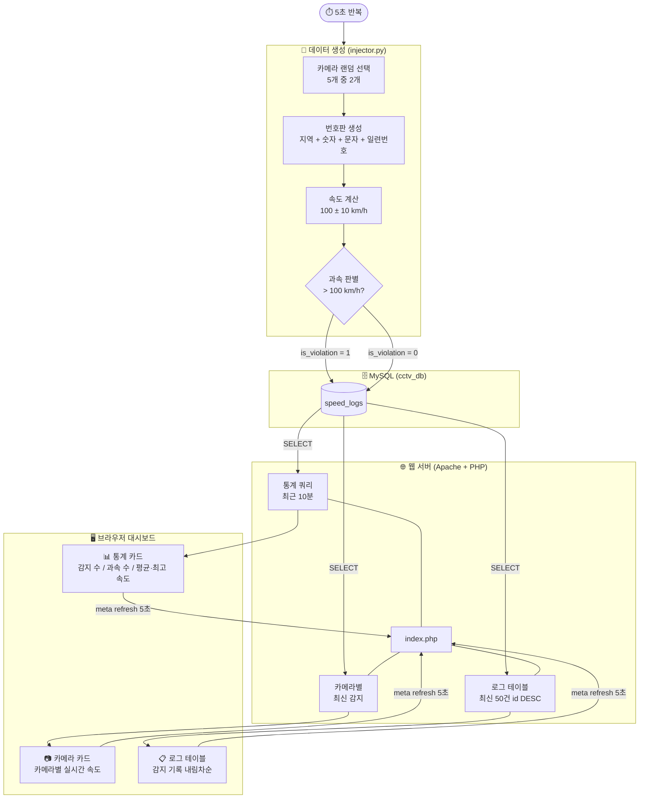

```mermaid
flowchart TD
    subgraph GEN["🐍 데이터 생성 (injector.py)"]
        A1[카메라 랜덤 선택\n5개 중 2개]
        A2[번호판 생성\n지역 + 숫자 + 문자 + 일련번호]
        A3[속도 계산\n100 ± 10 km/h]
        A4{과속 판별\n> 100 km/h?}
        A1 --> A2 --> A3 --> A4
    end

    subgraph DB["🗄️ MySQL (cctv_db)"]
        B1[(speed_logs)]
    end

    subgraph WEB["🌐 웹 서버 (Apache + PHP)"]
        C1[index.php]
        C2[통계 쿼리\n최근 10분]
        C3[카메라별\n최신 감지]
        C4[로그 테이블\n최신 50건 id DESC]
    end

    subgraph UI["🖥️ 브라우저 대시보드"]
        D1[📊 통계 카드\n감지 수 / 과속 수 / 평균·최고 속도]
        D2[📷 카메라 카드\n카메라별 실시간 속도]
        D3[📋 로그 테이블\n감지 기록 내림차순]
    end

    A4 -->|is_violation = 1| B1
    A4 -->|is_violation = 0| B1

    B1 -->|SELECT| C2 & C3 & C4
    C1 --- C2 & C3 & C4

    C2 --> D1
    C3 --> D2
    C4 --> D3

    D1 & D2 & D3 -->|meta refresh 5초| C1

    TIMER([⏱️ 5초 반복]) --> GEN
```