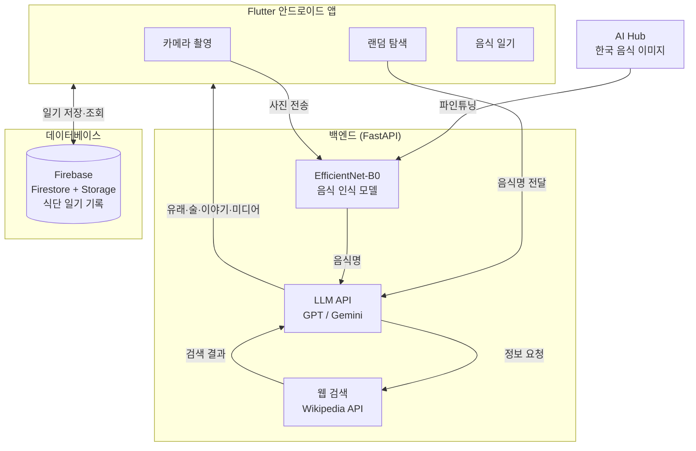
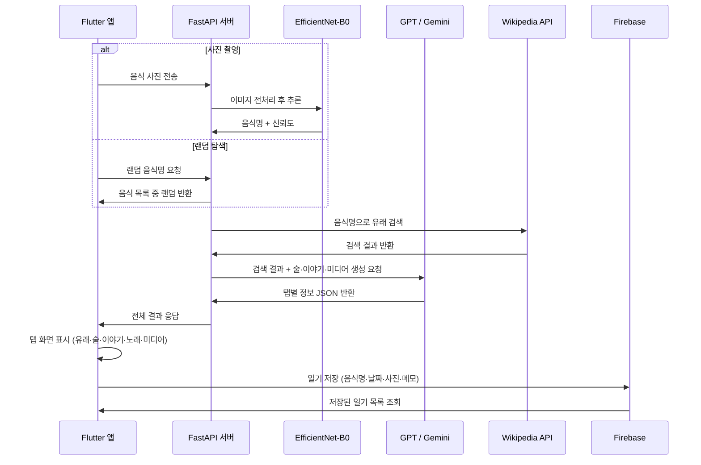

# 🍽️ AI 음식 스토리 안드로이드 앱

> EfficientNet 기반 한식 음식 인식 + LLM 정보 생성 + Firebase 클라우드 + Flutter 안드로이드 앱

---

## 배경 및 필요성

음식은 단순한 끼니가 아니라 역사·문화·이야기가 담긴 콘텐츠다.
그러나 기존 음식 관련 앱은 칼로리·영양 정보에만 집중되어 있어,
음식이 가진 문화적 맥락과 이야기를 즐기는 경험을 제공하지 못하고 있다.

### 개발 목적

1. **음식을 이야기로** — 사진 한 장으로 음식의 유래·문화·어울리는 술·관련 이야기·노래·미디어 등장 장면까지 탐색할 수 있는 앱을 개발한다.
2. **사진 없이도 탐색** — 랜덤 음식 탐색 기능으로 사진 촬영 없이도 매일 새로운 음식 이야기를 발견할 수 있게 한다.
3. **나만의 기록** — 음식 일기 기능으로 탐색한 음식과 이야기를 저장하고 돌아볼 수 있게 한다.

---

## 시스템 구조



---

## 데이터 흐름



---

## 앱 화면 구성

| 화면 | 설명 |
|------|------|
| 촬영 화면 | 카메라로 음식 사진 촬영 또는 갤러리에서 불러오기 |
| 인식 결과 | 음식명 + 신뢰도 표시, 탭 화면으로 이동 |
| 유래 탭 | 음식의 역사·기원·지역 정보 |
| 술 탭 | 어울리는 주류 및 페어링 이유 |
| 이야기 탭 | 관련 문화·속담·흥미로운 에피소드 |
| 노래 탭 | 음식 분위기에 어울리는 노래 추천 |
| 미디어 탭 | 영화·드라마·책에 등장하는 장면 소개 |
| 랜덤 탐색 | 오늘의 음식 랜덤 소개, 계속 탐색 가능 |
| 음식 일기 | 저장된 음식 기록 날짜순 / 카테고리별 열람 |

---

## 주요 기능

| 기능 | 설명 |
|------|------|
| 한식 음식 인식 | EfficientNet-B0로 한식 100종 분류 |
| 탭별 이야기 제공 | 유래·술·이야기·노래·미디어 5가지 탭 |
| 미디어 속 음식 | LLM이 영화·드라마·책·노래 등장 장면 생성 |
| 랜덤 탐색 | 사진 없이 매일 새 음식 이야기 발견 |
| 음식 일기 | Firebase에 탐색 기록 저장 및 열람 |
| 딥링크 연결 | 유튜브·검색으로 바로 이동 |

---

## 기술 스택

| 파트 | 라이브러리 / 도구 | 역할 |
|------|----------------|------|
| 모바일 앱 | Flutter (Dart) | 안드로이드 앱 UI |
| AI 모델 | PyTorch, EfficientNet-B0 | 한식 음식 분류 |
| 백엔드 | FastAPI (Python) | 추론·검색·LLM 통합 처리 |
| 정보 생성 | GPT API 또는 Gemini API | 탭별 콘텐츠 생성 |
| 정보 검색 | Wikipedia API | 음식 유래·역사 검색 |
| 클라우드 DB | Firebase Firestore + Storage | 음식 일기 저장 |
| 학습 데이터 | AI Hub 한국 음식 이미지 | EfficientNet-B0 파인튜닝 |
| 배포 | Railway 또는 Render | FastAPI 서버 무료 배포 |

---

## 폴더 구조

```
food-story-app/
├── flutter_app/                # Flutter 안드로이드 앱
│   ├── lib/
│   │   ├── main.dart
│   │   ├── screens/
│   │   │   ├── camera_screen.dart      # 촬영 화면
│   │   │   ├── result_screen.dart      # 인식 결과 + 탭
│   │   │   ├── explore_screen.dart     # 랜덤 탐색
│   │   │   └── diary_screen.dart       # 음식 일기
│   │   └── services/
│   │       ├── api_service.dart        # FastAPI 통신
│   │       └── firebase_service.dart   # Firebase 연동
│   └── pubspec.yaml
├── server/                     # FastAPI 백엔드
│   ├── main.py                 # FastAPI 메인
│   ├── model/
│   │   ├── train.py            # EfficientNet-B0 파인튜닝
│   │   └── predict.py          # 추론 함수
│   └── services/
│       ├── llm_service.py      # GPT / Gemini 연동
│       └── wiki_service.py     # Wikipedia API 연동
├── requirements.txt
└── README.md
```

---

## 실행 방법

```bash
# 1. 서버 의존성 설치
pip install -r requirements.txt

# 2. 모델 학습 (AI Hub 데이터셋 준비 후)
python server/model/train.py

# 3. FastAPI 서버 실행
uvicorn server.main:app --reload

# 4. Flutter 앱 실행
cd flutter_app && flutter run
```

---

## 개발 단계

1. **Phase 1**: AI Hub 데이터셋 수집 및 EfficientNet-B0 파인튜닝
2. **Phase 2**: FastAPI 서버 구축 (추론 + Wikipedia + LLM 통합)
3. **Phase 3**: Flutter 앱 개발 (촬영 → 결과 → 탭 화면)
4. **Phase 4**: 랜덤 탐색 + 음식 일기 + Firebase 연동
5. **Phase 5**: 미디어 탭 추가 및 딥링크 연결
6. **Phase 6**: 통합 테스트 및 배포

---

## 데이터셋

- **[AI Hub 한국 음식 이미지](https://aihub.or.kr)** — 한식 150여 종, 수십만 장 (무료 신청)

---

## 기대 효과 및 차별점

| 항목 | 내용 |
|------|------|
| 콘텐츠 차별화 | 칼로리 앱과 달리 음식을 이야기·문화로 즐기는 경험 제공 |
| 사진 없이도 사용 | 랜덤 탐색으로 매일 앱을 열 이유 확보 |
| 기록 기능 | 음식 일기로 나만의 음식 스토리북 형성 |
| 미디어 연결 | 영화·드라마·책과 음식을 연결하는 독창적 콘텐츠 |
| 확장 가능성 | 나라별 음식 비교, 계절·지역 연결, SNS 카드 공유로 확장 가능 |

---

## 라이선스

이 프로젝트는 MIT 라이선스를 따릅니다.
