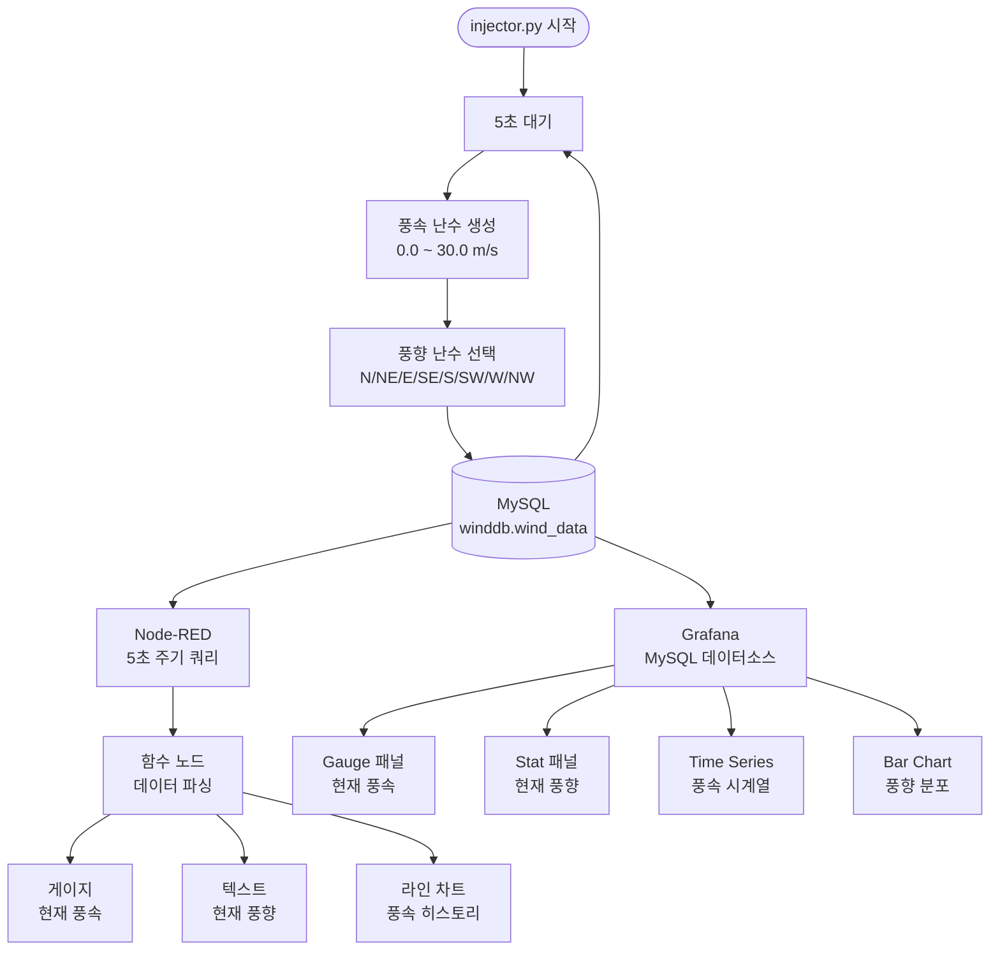

# Wind Monitor Project

풍속(m/s)과 풍향(8방위) 데이터를 실시간으로 생성하여 MySQL에 저장하고,
Node-RED 및 Grafana 대시보드로 모니터링하는 프로젝트입니다.

---

## 시스템 구성

| 구성 요소 | 역할 |
|----------|------|
| `injector.py` | 풍속/풍향 난수 생성 → MySQL 저장 (5초 주기) |
| MySQL (LAMP) | `winddb.wind_data` 테이블에 데이터 적재 |
| Node-RED | MySQL 조회 → 실시간 대시보드 표시 |
| Grafana | MySQL 데이터 소스 → 시계열/분포 시각화 |

---

## 동작 흐름



---

## 데이터베이스 구조

```sql
CREATE DATABASE winddb;

CREATE TABLE wind_data (
    id         INT AUTO_INCREMENT PRIMARY KEY,
    speed      FLOAT       NOT NULL,   -- 단위: m/s
    direction  VARCHAR(3)  NOT NULL,   -- N/NE/E/SE/S/SW/W/NW
    created_at DATETIME    DEFAULT CURRENT_TIMESTAMP
);
```

---

## 설치 및 실행

### 1. 패키지 설치

```bash
uv add mysql-connector-python
```

### 2. 데이터 생성

```bash
uv run injector.py
```

### 3. Node-RED 설정

```bash
# 필수 노드 설치
npm install node-red-node-mysql node-red-dashboard

# Node-RED 실행 후 http://localhost:1880 접속
# 우측 상단 메뉴 → Import → nodered_flow.json 붙여넣기
# MySQL 노드 더블클릭 → user/password 입력 후 Deploy
```

### 4. Grafana 설정

```
1. http://localhost:3000 접속 (기본 admin/admin)
2. Connections → Add new data source → MySQL 선택
   - Host: localhost:3306
   - Database: winddb
   - User: root / Password: (LAMP 비밀번호)
   - uid 필드: winddb_ds  ← 대시보드 JSON과 일치해야 함
3. Dashboards → Import → grafana_dashboard.json 업로드
```

---

## 파일 구성

```
wind_monitor/
├── injector.py            # 데이터 생성 및 MySQL 저장
├── nodered_flow.json      # Node-RED 임포트용 플로우
├── grafana_dashboard.json # Grafana 임포트용 대시보드
└── project.md             # 프로젝트 문서 (이 파일)
```
